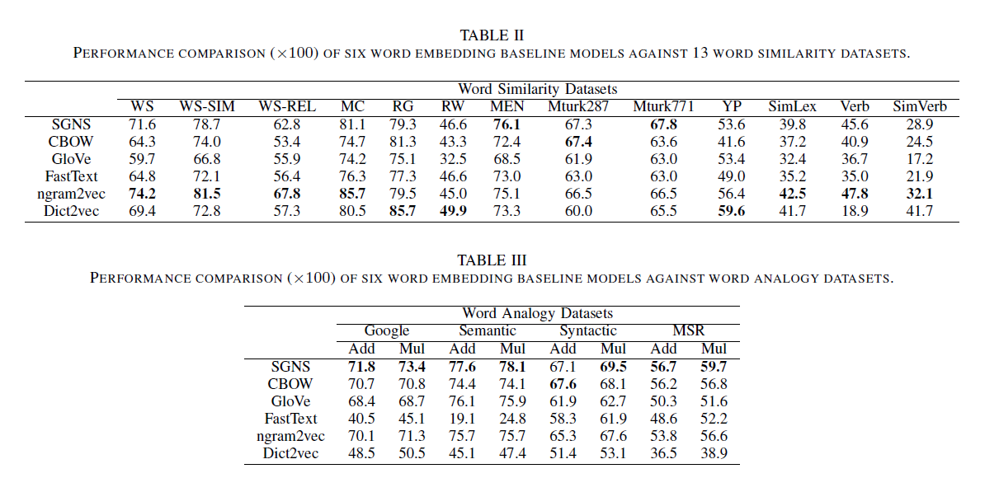

# Literature Review

    Paper 4: "Evaluating Word Embedding Models: Methods and Experimental Results" (Wang et al.)

## Introduction

- There are 2 types of evaluators:

  1. Intrinsic evaluator: test the quality of a representation independent of specific NLP tasks.
  2. Extrinsic evaluator: use word embeddings as input features to a downstream task and measure changes in performance metrics specific to that task.

- 6 embedding models were evaluated:
  1. Skip-gram negative sampling (SGNS)
  2. CBOW
  3. GloVe
  4. FastText
  5. ngram2vec
  6. Dict2vec

## Desired properties of Embedding models and Evaluators

### Embedding models

- **Non-conflation**: Different local contexts around a word should give rise to specific properties of the word e.g., the plural or singular form, the tenses, etc. Embedding models should be able to discern differences in the contexts and encode these details into a meaningful representation in the word subspace.
- **Robustness Against Lexical Ambiguity**: All senses of a word should be represented. Model should be able to discern the sense of a word from its context and find appropriate embedding.
- **Demonstration of Multifacetedness**: The facet, phonetic, morphological, syntactic, and other properties, of a word should contribute to its final representation. For example, a representation of a word should change when its tense is changed or a prefix is added.
- **Reliability**: Even if a model creates different representations from the same dataset because of random initialization, the performance of various representations should score consistently.
- **Good Geometry**: The geometry of an embedding space should have good spread. Word models should overcome the difficulty of arising from inconsistent frequency of word usage and derive some meaning from word frequency.

### Evaluator

- **Good testing data**: testing data should be varied with a good spread in the span of word space. Frequently and rarely occurring words should be included in the evaluation.
- **Comprehensiveness**: Ideally, an evaluator should test for many properties of a word embedding model.
- **High correlation**: The score of a word model in an _intrinsic evaluation_ task should correlate well with the performance of the ones in downstream NLP tasks (extrinsic)
- **Efficiency**: Evaluator should be computational efficient. It should be simple yet able to predict the downstream performance of a model.
- **Statistical Significant**: The performance of different word embedding models wrt to an evaluator should have enough statistical significance, or enough variance between score distribution, to be differentiated.

## Intrinsic Evaluators

They measure syntactic or semantic relationships between word directly.

### 1. Word Similarity

- The word similarity evaluator correlates the distance between word vectors and human perceived semantic similarity. The way distributional semantic models simulate similarity is still ambiguous.
- One commonly used evaluator is the cosine similarity:

$$
  \begin{align}
    cos(w_x, w_y) = \frac{w_x \cdot w_y}{\lVert w_x \rVert \lVert w_y \rVert}
  \end{align}
$$

- where $w_x$ and $w_y$ are 2 word vectors and $\lVert w_x \rVert$ and $\lVert w_y \rVert$ are the $\mathbb{l_2}$ norm ($l_2$ → calculates the distance of the vector coordinate from the origin of the vector space)
- This on the other hand has several problems. This test is aimed at finding distributional similarity among pairs of words, but this is often conflated with morphological relations (play, playground) and simple collocations (social media, machine learning). Similarity maybe confused with relatedness.
- Example: _car_ and _train_ are two similar words, while _car_ and _road_ are two related words. The correlation between score from intrinsic test and other extrinsic test could be low in some cases.
- This might not be comprehensive.

### 2. Word Analogy

- When given a pair of words $a$ and $a^*$ and a third word $b$, the analogy relationship between $a$ and $a^*$ can be used to find the corresponding word $b$ to $b^*$. One example could be:
- write : writing :: read : <u>reading</u>.
- The _3CosAdd_ method solves for $b^*$ using the following equation:

$$
  \begin{align}
    b^* = \underset{b^{'}}{\operatorname{argmax}}(cos(b^{'}, a^* - a + b))
  \end{align}
$$

- Thus, high cosine similarity means that vectors share a similar director. However, it is important to note that _3CosAdd_ method normalizes vector lengths using cosine similarity. **Since cosine is inverse to the angle, high cosine similarity (close to 1) means the vectors share a very similar direction. Note that this metric normalizes (and thus ignore) the vector's lengths, unlike Euclidean distance between them.**
- Alternatively, there is the _3CosMul_ method, which defined as:

$$
  \begin{align}
    b^* = \underset{b^{'}}{\operatorname{argmax}} \frac{cos(b^{'},b)cos(b^{'}, a^*)}{cos(b^{'}, a)+\epsilon}
  \end{align}
$$

- where $\epsilon = 0.001$ us used to prevent division by zero.
- With _3CosMul_, small difference are enlarged while large ones are suppressed.
- Many models score under 30% on analogy tests, suggesting that not all relations can be identified in this way.
- It is mentioned that the analogy test is most successful when all the three source vectors are relatively close to the target vector. Accuracy of this test decreases as their distance increases.
- Another seemingly counter-intuitive finding is that words with denser neighborhoods yields higher accuracy.

- The analogy test is subjective. The dataset on which current models are trained does not encode our human sense and reasoning. Thus, given a word pair, the vector space model may find a different relationship from what human may find

### 3. Concept Categorization

- Given a task of separating words into 2 categories, the model should be able to categorize words sandwiches, tea, pasta, water into 2 groups.
- Use Clustering algorithms to separate words into $n$ different categories.
- One big problem is that: _Words_ can belong to multiple categories.
- Due to the uncompromising nature of the performance metric, there is no adequate method in evaluation each cluster's quality.

### 4. Outlier Detection

- The goal is to find words that do not belong to a given group of words.
- There is a clear gold standard for this evaluator since human performance on this task is extremely high as compare to word similarity tasks. **It is also less subjective**.
- To formalize this evaluator mathematically, we can take a set of words:

$$
  \begin{align}
    W = w_1, w_2, \dots, w_{n+1},
  \end{align}
$$

- where there is one outlier. Next we take a compactness score of word $w$ as:

$$
  \begin{align}
    c(w) = \frac{1}{n(n-1)} \sum_{w_i \in W \backslash w  } \sum_{w_j \in W \backslash w, w_j \neq w_i} sim(w_i,w_j)
  \end{align}
$$

- The outlier is the word with the lowest compactness score.
- Also, being similar to the word analogy evaluator, this evaluator relies heavily on human reasoning and logic.
- The outliers defined by humans are strongly influenced by the characteristics of words perceived to be important. Yet, the recognized patterns might not be immediately clear to word embeddings models.

### 5. QVEC

- QVEC is an intrinsic evaluator that measures the component-wise correlation between word vectors from a word embedding model and manually constructed linguistic word vectors in the SemCor dataset.
- The most prevalent problem with this evaluator is the subjectivity of man-made linguistic vectors. Current word embedding techniques perform much better than man-made models as they are based on statistical relations from data.

## Experimental Results of Intrinsic Evaluators

- 6 embeddings models as mentioned above were used to experiment.
- For consistency, the training of the model were based on the same corpus - wiki2010. Medium size around 6G
- **After preprocessing, all special characters were removed**.
- Some models may perform better when being trained on larger datasets while others are less dataset dependent.
- The same training dataset is used to fit a more general situation for fair comparison among different models.
- For all the embedding models, the official released toolkit and default setting for training were used.
- 13 datasets for _Word Similarity_ were used:

- Among the 13 datasets, WS-353, WS-353-SIM, WS-353-REL, Rare-Word are more popular because of their high quality of word pairs.
- 2 datasets for _Word Analogy_ were used: 1. the Google dataset, and 2. the MSR dataset. Google dataset is divided into 2 categories of 'semantic' and 'morpho-syntactic'.Both _3CosAdd_ and _3CosMul_ inference methods are implemented.
- 3 datasets for _Concept Categorization_ were used. 1. AP dataset, 2. BLESS dataset, 3. BM dataset.
- 2 datasets were adopted for this task. 1. WordSim-500, and 2. 8-8-8 dataset

Experimental Results:

- _Word Similarity_:

  - We see that SGNS-based models perform better generally. Note that ngram2vec is an improvement to SGNS, and its performance is the best.
  - Dict2Vec model provides the best result against the RW dataset. This could be attributed to that Dict2Vec is fine-tuned word vectors based on dictionaries, the Dict2Vec model is able to give better representation over rare words.

- _Word Analogy_:

  - SGNS performs the best
  - Since, ngram2vec considers n-gram modes, the relationship within word sets maybe not probably captured.
  - Dictionaries do not have such word sets, and thus, word analogy is not well-presented in the word vectors of Dict2Vec.
  - FastText uses sub-words, its syntactic result is much better than its semantic result.

- _Concept Categorization_:

  - It can be seen that SGNS-based models (including SGNS, ngram2vec, and Dict2vec) perform better than others on all the three datasets.

- _Outlier Detection_:

  - Based on the observed performances, they are not consistent with each other for the 2 datasets. For instance, GloVe has the best performance on the WordSim-500, but its accuracy on the 8-8-8 dataset is the worst.
  - This could be explained by the properties of the dataset

- _QVEC_:
  - The QVEC toolkit was used.
  - ngram2vec performs the best among the 6 embedding models.

## Experimental Results of Extrinsic Evaluators

- 5 extrinsic evaluators were used:

  - POS tagging
  - Chunking
  - NER
  - Sentiment Analysis
  - NMT

- For POS tagging, Chunking, and NER use the following datasets:
  - The Penn Treebank (PTB), the chunking of ColNLL'00 share task dataset, and the NER of CoNLL'03 shared task dataset.
  - For inference tool, it used a simple window-based feed-forward nn architecture. It takes input of 5 at one time and passes them through **300-unit hidden layer**, a **tanh activation** function and a softmax layer before generating the result. It was trained on **10 epochs** using **Adam optimizer** with a **batch of 50**.

- Sentiment Analysis: 2 datasets were used

  - 1. Internet Movie Database (IMBDb), and 2. Stanford Sentiment Treebank (SST). IMBDb contains 2 classes (negative, positive) and it consists of several sentences while SST has 3 classes (negative, neutral, positive) which consists of single sentence per label.

  

  - This task was test on Bi_LSTM and CNN.
  - For Bi-LSTM, they choose 2-layer Bi-LSTM with 256 hidden dimension
  - The adopted CNN has 3 layers with 100 filters per layer of size [3,4,5], respectively.
  - The embedding layers for all models are **fixed during training**, and all models are trained for **5 epochs** using the **Adam Optimizer**
