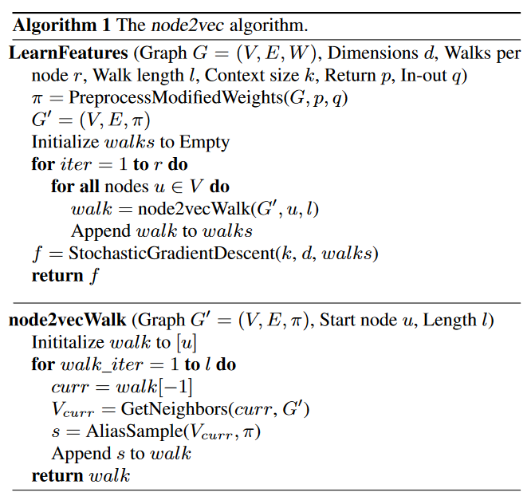
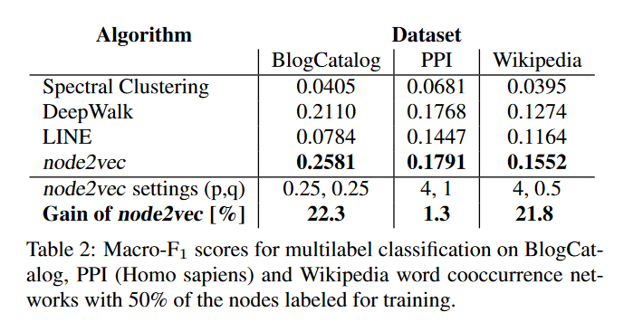
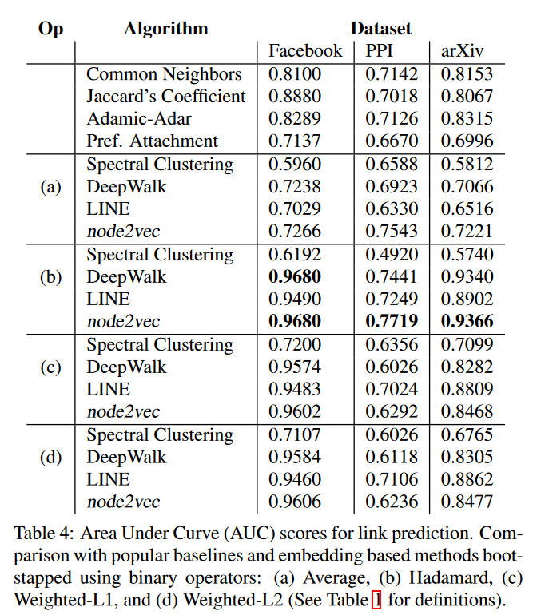

# Literature Review

    Paper 3: "node2vec: Scalable Feature Learning for Networks" (Grover et al.)

## Previous Approaches

- Hand-engineering domain-specific features based on expert knowledge: this method doesn't generalize across different prediction tasks.
- Learning feature representation by solving an optimization problem: this method results in good accuracy with a cost of high training time complexity due to a big number of parameters.
- Classical approach based on linear and non-linear dimension reduction techniques such as **Principal Component Analysis, Multi-Dimensional Scaling** are expensive for large real-world networks, and resulting in latent representations that give poor performance on various prediction tasks over networks.

## Proposed Method: `node2vec`

- A semi-supervise algorithm for scalable feature learning in network.
- This approach returns feature representations that maximize the likelihood of preserving network neighborhoods of nodes in a d-dimensional feature space.
- It uses 2nd order random walk approach to generate (sample) network neighborhoods for nodes.
- `node2vec` can learn representations that organize nodes based on their network roles and/or communities they belong to.
- Can also generate representation of edges.
- The experiment for this method is based on 2 prediction tasks:
  1. Multi-label classification task
  2. Link prediction task

## Feature Learning Framework

- Let $G = (V,E)$ be a given network
- Let $f : V \rightarrow \mathbb{R}^{d}$ be the mapping function from nodes to feature representations we aim to learn for downstream tasks.
  - $d$ is the parameter specifying the number of dimension of the feature representation
  - $f$ is a matrix of size $|V| \times d$ parameters
- For every source node $u \in V$, $N_S(u) \subset V$ is a _network neighborhood of node_ $u$ generated through a neighborhood sampling strategy $S$
- The goal is to optimize the following objective functions, which maximizes the log-probability of observing a network neighborhood $N_S(u)$ for a node $u$

$$
  \begin{align}
  \max_{{f}} \sum_{u \in V}  \left[- log  Z_u + \sum_{n_i \in N_S(u)} f(n_i) \cdot f(u)\right]
  \end{align}
$$

- Unlike Skip-gram architecture that is originally developed in the context of _natural language_, given a linear nature of text, the notion of neighborhood can be naturally defined using a sliding window over consecutive words.
- Networks, however are not linear, to resolve this issue, a randomized procedure that samples many neighborhoods of a given source node $u$ is proposed.

### Classic search strategies

- Generally, there are 2 extreme sampling strategies:
  - **Breadth-first Sampling (BFS)**: The neighborhood $N_S$ is restricted to nodes which are immediate neighbors of the source
  - **Depth-first Sampling (DFS)**: The neighborhood consists of nodes sequentially sampled at increasing distances from the source.
- Under the _homophily hypothesis_, nodes that are highly interconnected and belong to similar network cluster or communities should be embedded closely together.
- Under _structural equivalence hypothesis_, nodes that have similar structural roles in networks should be embedded closely together.
- Neighborhood sampled by **BFS** lead to embeddings that correspond closely to _structural equivalent_.

### `node2vec`: Random Walks

- Give a source node $u$, we simulate a random walk of fixed length $l$.
- $c_i$ denote the $i$th node in the walk, starting with $c_0 = u$.
- Nodes $c_i$ are generated by the following distribution:

$$
  \begin{align}
    P(c_i = x | c_{i-1}=v) =
    \begin{cases}
      \frac{\pi_{vx}}{Z}  & \text{if}\ (v,x) \in E \\
      0  & \text{otherwise}
    \end{cases}
  \end{align}
$$

Where $\pi_{vx}$ is the unnormalized transition probability between nodes $v$ and $x$, and $Z$ is the normalized constant.

### Search bias $\alpha$

- A 2nd order random walk with two parameter $p$ and $q$ is defined, which guide the walk.
- Consider a random walk that just traverse from edge $(t,v)$ and now resides at node $v$. The walk now needs to decide on the next step, so it evaluates the transition probabilities $\pi_{vx}$ on edges $(v,x)$ leading from $v$.

- Setting the unormalized transition probability to $\pi_{vx} = \alpha_{pq}(t,x) \cdot w_{vx}$ where

$$
  \begin{align}
    \alpha_{pq}(t,x) =
    \begin{cases}
      \frac{1}{p}  & \text{if}\ d_{tx} = 0 \\
      1  & \text{if}\ d_{tx} = 1  \\
      \frac{1}{q}  & \text{if}\ d_{tx} = 2 \
    \end{cases}
  \end{align}
$$

- And $d_{tx}$ denotes the shortest path distance between nodes $t$ and $x$
- $d_{tx}$ must be one of {0,1,2}
- Intuitively, parameters $p$ and $q$ control how fast the walk explores and leaves the neighborhood of starting node $u$.
- **Return parameter p**: controls the likelihood of immediately revisiting a node in a walk. Setting it to high value $(> max(q,1))$ ensures that we are less likely to sample an already visited node in the following two steps.
- **In-out parameter q**: allows the search to differentiate between "inward" and "outward" nodes. In the figure above, if $q >1$, the random walk is biased toward nodes that are closer to node $t$. In contrast, if $q<1$, the walk is more inclined to visit nodes which are further away from node $t$.

### `node2vec` algorithm:

## Experiments

- The experiments are based on 2 supervised learning tasks:
  1. Multi-label classification for nodes.
  2. Link prediction for edges.

### Multi-label classification

- The dataset were used:
  - **BlogCatalog**: this is a network of social relationship. The network has 10,312 nodes, 333,983 edges, and 39 labels.
  - **Protien-Protien** Interactions (PPI): A subgraph of PPI network for Homo Spaiens was used. The network has 3,890 nodes, 76,584 edges, and 50 labels.
  - **Wikipedia**: This is a cooccurrence network of words appearing in the first million bytes of the Wikipedia dump. The network has 4,777 nodes, 184,812 edges, and 40 different labels.

### Link prediction

- The dataset were used:
  - **Facebook**: nodes represent users, and edges represent a friendship relation between any 2 users. The network has 4,039 nodes, 88,234 edges.
  - **Protien-Protien** Interactions (PPI): nodes represent proteins, and an edge indicates a biological interaction between a pair of proteins. The network has 19,706 nodes, 390,633 edges.
  - **Wikipedia**: This is a collaboration network generated from appears submitted to the e-print arXiv where nodes represent scientists, and an edge is present between two scientists if they have collaborated in a paper. The network has 18,722 nodes, 198,110 edges.

